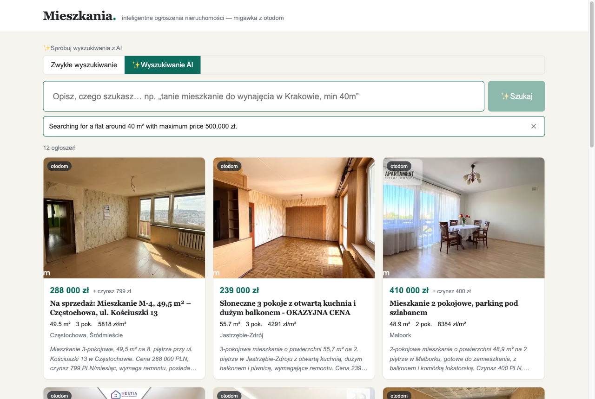

# Smart Listings

A real-estate listings app that scrapes ~100 real Polish apartment offers,
cleans up the messy real-world data (missing fields, duplicates, odd formats),
enriches it with AI, and serves a filterable UI with **natural-language search** —
type *"a cheap flat around 40 m²"* and it turns your words into filters.


## Run it (one command)

You only need **[Docker](https://docs.docker.com/get-docker/)** installed and running.

```bash
cp .env.example .env      # optional: paste an ANTHROPIC_API_KEY to enable AI search
docker compose up         # builds everything, starts MySQL, seeds data, serves
```

Then open **<http://localhost:3004>**. That's it — no Node, no manual build, no database setup.

> The listings data ships inside the repo, so the app works fully offline.
> The AI key is **optional**: without it, browsing, filtering, and text search
> all still work — only the AI search box falls back to plain text.

To stop it: `Ctrl+C`, or `docker compose down` to also remove the containers.

## What you can do

- **Filter & browse** — offer type, city, price, area, rooms, and text search, with pagination. Every search is a shareable URL.
- **Natural-language search** — describe what you want; AI turns it into filters and shows you exactly what it applied.
- **Offer detail** — the full listing with an AI summary and a link back to the original source.

**Natural-language search** — *"a flat around 40 m² under 500,000 zł"* becomes real filters:



**Offer detail** — full data, AI summary, and a link back to the source:


## How it works

```
otodom  →  scrape  →  normalize (deterministic)  →  AI gap-fill + summaries
                                                            │
                                       data/enriched/listings.json  (shipped in repo)
                                                            │
                                        seed → MySQL → repo → API → Vue app
```

Prices, areas, rooms, and floors are parsed by plain code — never guessed by AI.
The AI only fills gaps the text leaves and powers the search box. Anything
unparseable stays an explicit `null` and shows as "—", never a fabricated value.

The reasoning behind these choices is the real deliverable — see
**[REASONING.md](REASONING.md)**. The brief it answers is
**[requirements/REQUIREMENTS.md](requirements/REQUIREMENTS.md)**, and the
engineering conventions are in **[CLAUDE.md](CLAUDE.md)**.

## Developing locally (optional)

Prefer running the app on your machine with only the database in Docker:

```bash
cp .env.example .env
docker compose up -d db   # just MySQL 8
npm install
npm run dev               # API + Vite dev server with hot reload
```

| Command | What it does |
|---|---|
| `npm start` | Seed → build → serve on one port (production-style demo). |
| `npm run dev` | API + Vite dev server with hot reload, on separate ports. |
| `npm test` | Unit tests (normalization, dedupe, AI merge logic). |
| `npm run test:integration` | Repo/API integration tests (needs MySQL up). |
| `npm run typecheck` | Type-check the server. |

`scrape` and `ingest` are one-time author steps (they need network access and an
API key) that produced the committed dataset — you never need to run them.

## License

MIT — see [LICENSE](LICENSE).
